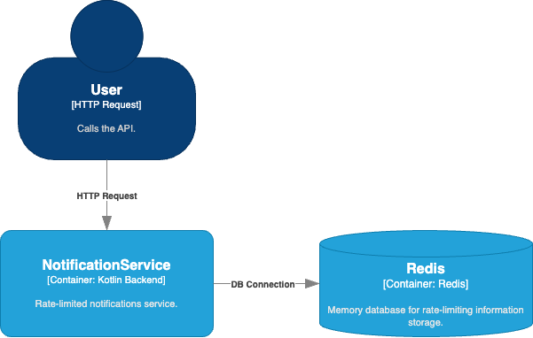
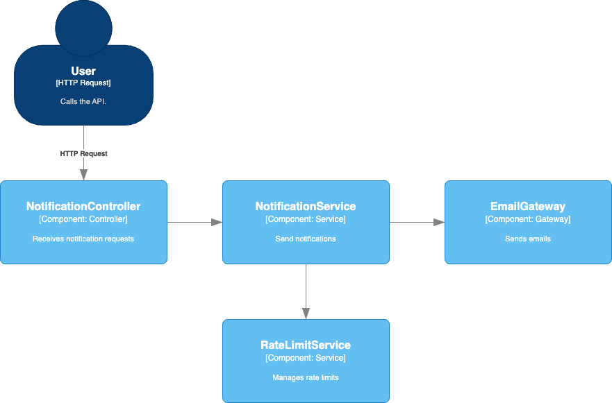

# Notification Service
Kotlin Backend service for sending email notifications powered with rate-limiting feature.

## 💻 Technologies
* Kotlin
* Spring Boot
* Redis

## 🚀 Getting Started
### Prerequisites
* Java 21
* Docker
* Docker Compose

### Running the application
1. Clone the repository
2. Run the following command to start the redis container:
```shell
docker-compose -f docker/docker-compose.yml up
```
3. Run the application:
```shell
./gradlew bootRun
```

## 🔎 Tests
To run the tests, run:
```shell
./gradlew test
```
The tests will run and generate a mutation tests report in the `build/reports/pitest/index.html` file.

## 📚 API Documentation
To access the API documentation, run the application and access the following URL:
```
http://localhost:8080/swagger-ui/index.html
```

## ⬜ C4 Diagram

More about C4 Model: [official website](https://c4model.com/).

### Containers


### Components


